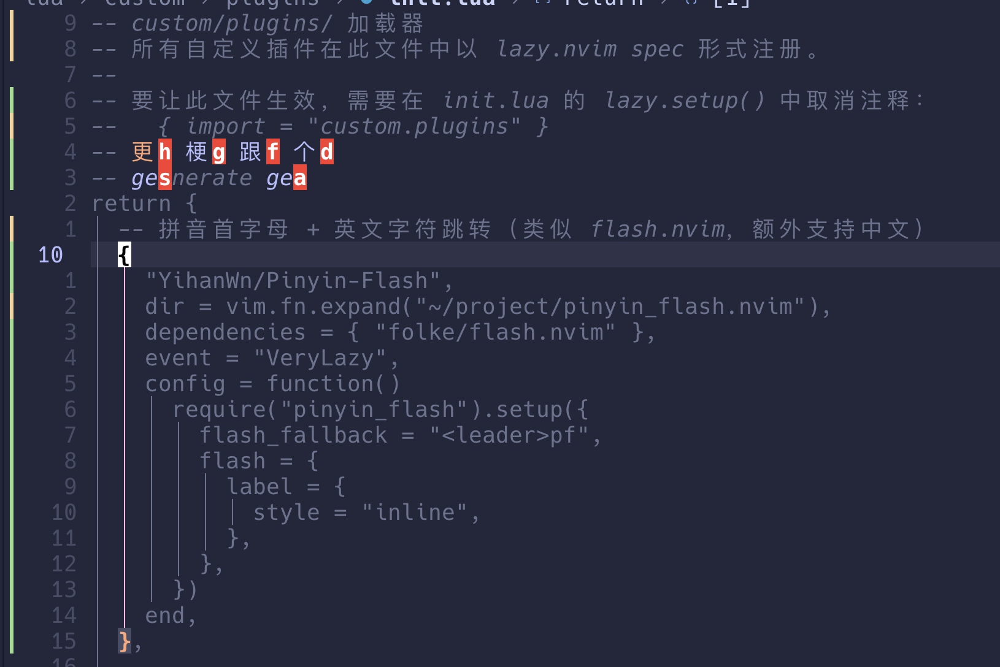

# Pinyin-Flash.nvim

拼音首字母 + 英文字符跳转，类似 [flash.nvim](https://github.com/folke/flash.nvim)，额外支持中文。

按 `s` 进入搜索，支持 flash.nvim 风格的多字符增量搜索：
- **英文/数字/符号**：匹配输入的所有字符（如 `ste` 搜索 "ste"）
- **中文**：按拼音前缀匹配汉字（如 `geng` 匹配「更」，`s` 匹配「是」「上」「说」…）
- 中英文匹配都会随输入增量缩小范围

按标签字母跳转，使用醒目的 flash.nvim 标签显示。

## 效果预览

拼音前缀匹配中文，输入 `geng` 可以逐步缩小到「更」, 同时保留 flash.nvim 原生英文搜索体验，英文和中文候选共享同一套标签跳转



## 安装

[lazy.nvim](https://github.com/folke/lazy.nvim):

```lua
{
  "YihanWn/Pinyin-Flash",
  event = "VeryLazy",
  config = function()
    require("pinyin_flash").setup()
  end,
}
```

## 键映射

| 按键 | 功能 |
|------|------|
| `s` | 中英文综合跳转（主触发键） |
| `<leader>pj` | 纯拼音首字母跳转 |
| `<leader>s` | 原版 flash.nvim 英文跳转（备用） |

## 自定义

```lua
require("pinyin_flash").setup({
  cn_keymap = "<leader>pj",     -- 纯拼音跳转快捷键
  en_keymap = "s",              -- 综合跳转快捷键（false 禁用）
  flash_fallback = "<leader>s", -- flash.nvim 备用快捷键
  flash = {                     -- 透传给 flash.nvim jump() 的配置
    label = { style = "inline" },
  },
})
```

## 依赖

- [flash.nvim](https://github.com/folke/flash.nvim) — `s` 键与 `<leader>s` 备用跳转需要

---

## 数据来源

拼音数据来自 [pinyin-data](https://github.com/mozillazg/pinyin-data) 中的 `kMandarin_8105.txt`:
《通用规范汉字表》(2013 年版) 8105 个汉字最常用的读音。

备选数据源: [Unihan](https://www.unicode.org/Public/UNIDATA/Unihan.zip) `Unihan_Readings.txt` (4w+ 条)。

## 更新拼音表

```bash
cd scripts
python pinyin2LuaTab.py
# 生成 lua/pinyin_flash/pinyin_map.lua
```

## License

MIT
